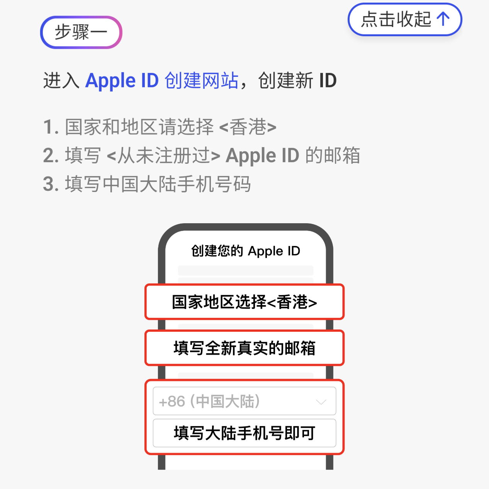
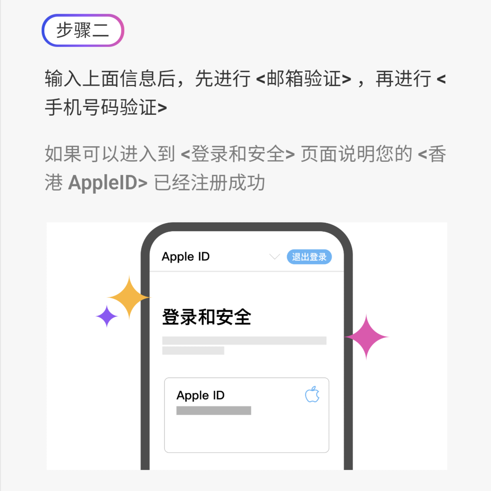
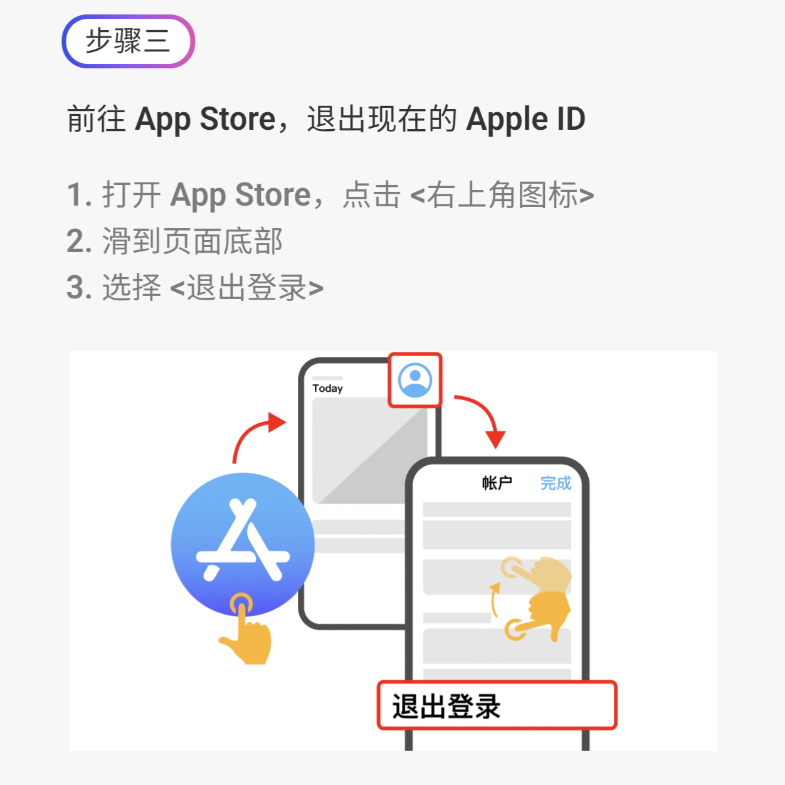
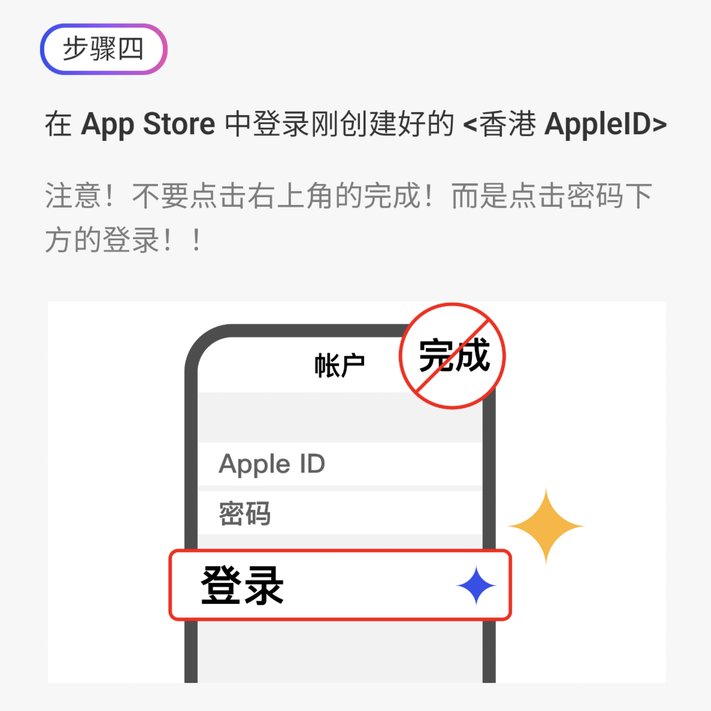
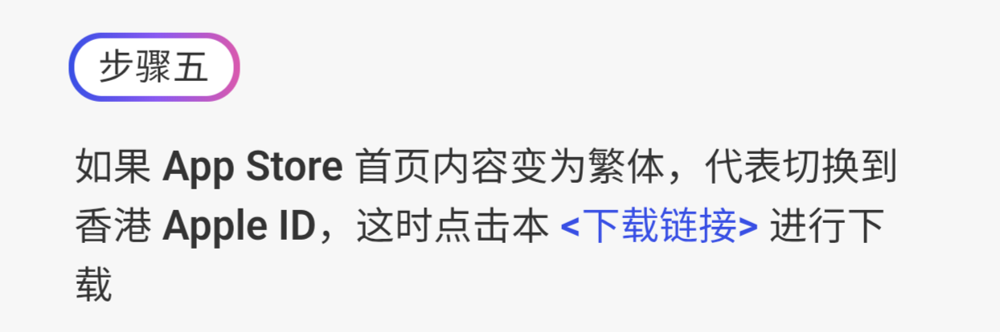
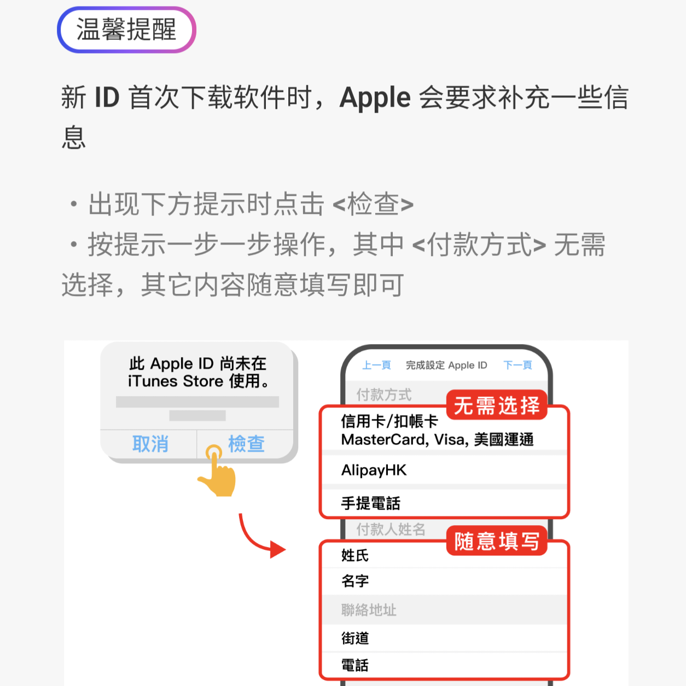

# 注册 iOS 香港 Apple ID

**iOS 用户必学：下载海外应用的基础指南**

许多 iOS 用户想要下载 **币安、Telegram** 等海外应用，必须先注册一个
**香港地区 Apple ID**。本指南将带你一步一步完成设置。

------------------------------------------------------------------------

## 📌 前往 Apple ID 创建页面

Apple 官方网站：<https://appleid.apple.com/account>

------------------------------------------------------------------------

## ✅ 步骤一：填写基本信息

1.  **国家或地区选择：** 香港\
2.  **填写邮箱：** 使用一个**从未注册过 Apple ID** 的邮箱\
3.  **手机号码：** 可填写 **中国大陆手机号**

------------------------------------------------------------------------

## ✅ 步骤二：验证信息

填写信息后系统会要求：

1.  **邮箱验证**\
2.  **手机号码验证**

验证成功后能进入 **「登录和安全」** 页面，即代表你的 **香港 Apple ID
已成功创建**。

------------------------------------------------------------------------

## ✅ 步骤三：退出当前 iCloud / App Store ID

1.  打开 **App Store**\
2.  点击右上角头像\
3.  滑到最底部\
4.  点击 **「退出登录」**

------------------------------------------------------------------------

## ✅ 步骤四：登录新的香港 Apple ID

在 App Store 里输入刚刚创建的 **香港账号与密码**。

⚠️ 注意：\
不要点右上角的 **完成**！\
请点密码下方的 **「登录」** 按钮！

------------------------------------------------------------------------

## ✅ 步骤五：确认已切换商店区域

如果 App Store 首页显示 **繁体中文内容**，说明已成功切换至
**香港商店**。

------------------------------------------------------------------------

## ✅ 温馨提醒：首次下载应用需要补充资料

首次下载任何 App 时，Apple 会要求补充部分信息：

-   出现提示时点击 **「检查」**\
-   按步骤填写资料\
-   **付款方式选择「无」**\
-   其余地址等信息可随意填写（无需真实地址）

